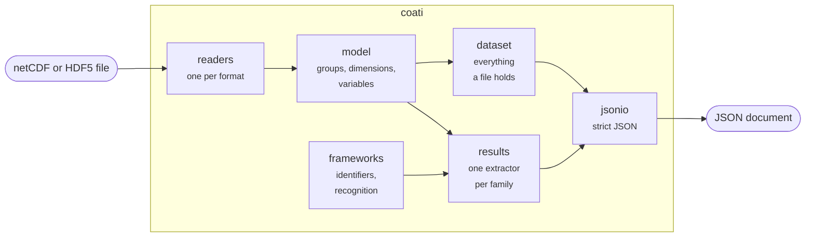

# Architecture

Coati turns a file into a document in three steps, each the business of one
part of the package:

1. A **reader** opens the file and describes it as a tree of groups,
   dimensions and variables, the same tree for every format.
2. An **extractor** reads from the tree what a model says, in the layout of
   one framework, and fills the results. The dataset document needs no
   extractor: it is the tree.
3. The **writer** writes the document as JSON.

## Modules

| Module | Owns |
|---|---|
| `coati.api` | what Coati does, as functions; the only module that opens and closes files |
| `coati.cli` | the command line: arguments, messages, exit status |
| `coati.readers` | the choice of the reader by the first bytes of a file |
| `coati.readers.hdf5` | netCDF-4 and HDF5, on top of h5py |
| `coati.readers.classic` | the classic netCDF formats, read from the bytes |
| `coati.readers.pytables` | the tables that pandas writes into HDF5 files, and their pickles |
| `coati.model` | the tree: `Dataset`, `Group`, `Variable`, `Dimension` |
| `coati.cf` | the interpretation of stored values: times, missing values, packed numbers |
| `coati.masked` | arrays in which values may be missing |
| `coati.labeled` | arrays with names for their axes and labels for their positions |
| `coati.yamltext` | the few values that the results need from the YAML of Calliope |
| `coati.frameworks` | the framework identifiers, the families and the recognition of a file |
| `coati.results` | the extractors, one module for each family of layouts |
| `coati.results.document` | the results and their document |
| `coati.dataset` | the dataset document |
| `coati.jsonio` | strict JSON for documents that hold NumPy data |
| `coati.schemas` | the JSON Schemas of the documents |
| `coati.errors` | the errors |

The modules depend on each other in one direction, from the top of the
table to the bottom of the diagram: `api` knows everything, a reader knows
the model and the errors, `jsonio` knows nothing of files.

## Decisions

### No framework, no xarray

Coati reads the files of three frameworks that cannot be installed
together in every combination of versions: Calliope 0.6 needs a Python that
is older than the one PyPSA 1.x supports. A converter that needed the
framework to read its file would have to be installed once for each. Coati
reads the files themselves.

It does so with h5py and NumPy alone. xarray would read the netCDF files
and pandas the tables of PyPSA, but both are large, change their behaviour
between versions, and interpret on their own what they read. The part of
them that Coati needs is small: dimensions and their scales for netCDF-4,
the table format of PyTables for PyPSA, the conventions of CF for times and
missing values. The tests compare what Coati reads with what the netCDF
library, xarray and SciPy read, for every variable of every test file.

### One tree for every format

The readers describe a file as the data model of netCDF has it, which is
the richest of the formats: groups that hold dimensions, variables and
attributes. An HDF5 file that is no netCDF fits in as a file without
dimensions. The extractors and the dataset document do not know which
format they read.

A reader reads the structure of a file when it opens the file and the
values of a variable when they are asked for. `coati inspect` reads no
values at all, and `coati dump` those of one variable at a time.

### The family decides, not the version

An extractor belongs to a family of versions that write the same layout,
not to a version. A new version of a framework that writes its files as
the versions before it did is read without a change to Coati; one that
changes the layout starts a new family, and the old families keep reading
what they read. The version that a caller names is nevertheless checked
and reported: it is part of what a document says about its origin.

### An identifier is a claim

The framework that a caller names is compared with what is found in the
file, and a file of another framework or family is refused. The
alternative, to read the file as what it is and to note the difference,
would hide a mix-up of files in a pipeline behind a document that looks
right.

### The document says what the framework says

An extractor does not compute what a framework could have computed; it
reports what the file holds, in the terms of the document. Where a
framework has its own definition of a quantity, that definition holds: the
costs of PyPSA are those of `n.statistics`, the weights of the classes of
cost of Calliope are those of its objective.

Where the frameworks differ, the document has one convention and the page
of the framework names the difference. A connection between two locations
has its capacity at both and its cost shared by both, whether the framework
writes it once, as PyPSA, twice, as AdOpT-NET0, or so, as Calliope.

### Strict JSON, written in pieces

The writer is not the encoder of the standard library with a hook for
NumPy. That encoder writes `NaN` and infinities, which are no JSON, and
needs the whole document as objects of Python, which for an array of a
million numbers is a list of a million objects. The writer of Coati walks
the document itself, applies the policy for numbers that are not finite to
every number, and hands arrays to the encoder of the standard library in
pieces of bounded size, as lists of numbers that are known to be finite.

A part of a document may be an object that is asked for its content when
the writer reaches it. The dataset document uses this to read the values of
a variable when the variable is written.

### Files cannot be trusted

A file may come from anywhere. The readers check what they read against
the size of the file, refuse pickles that name a class or a function, and
do not follow links into other files. See the
[security policy](https://github.com/enerplanet/Coati/blob/main/SECURITY.md).

## Adding a framework

1. Describe the framework in `coati.frameworks`: a family with its
   versions, and a function that recognises its files.
2. Write an extractor in `coati.results` that fills a `Results` from a
   `Dataset`, and register it for the family in `coati/results/__init__.py`.
3. Write a model of the framework in `tests/models` that has every kind of
   technology, with the facts that the framework states about it, and make
   its files; see [Testing](testing.md).
4. Describe how each key follows from a file on a page under
   `docs/frameworks/`.
